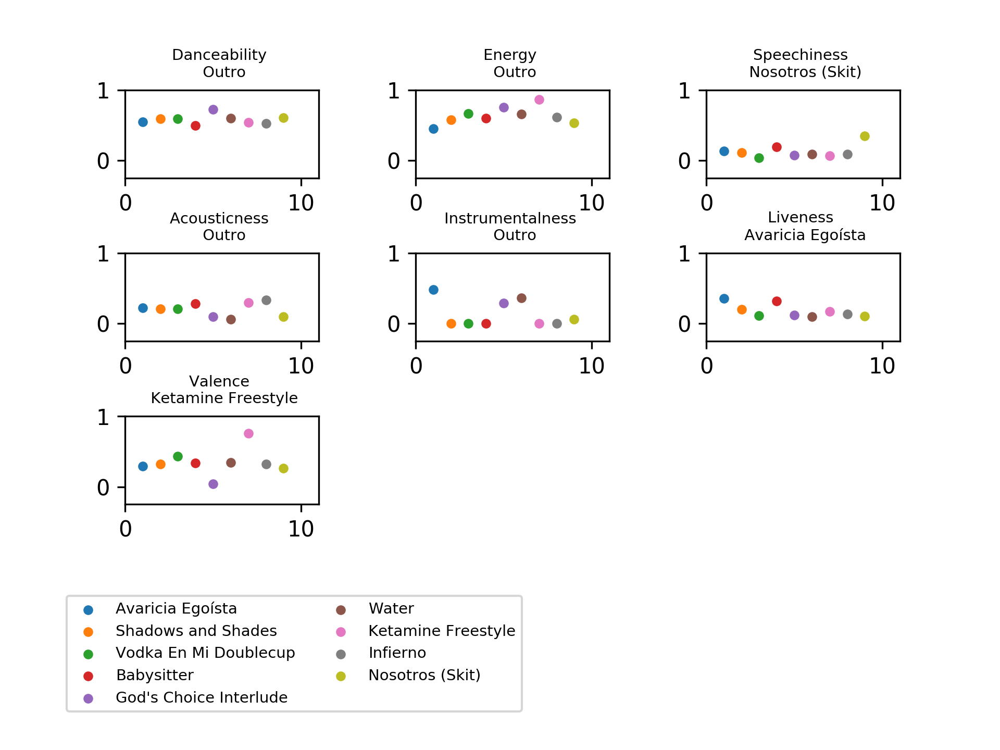
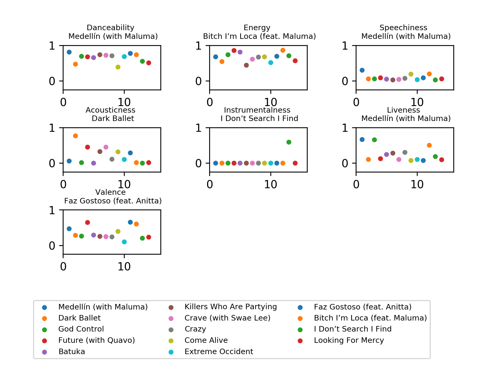
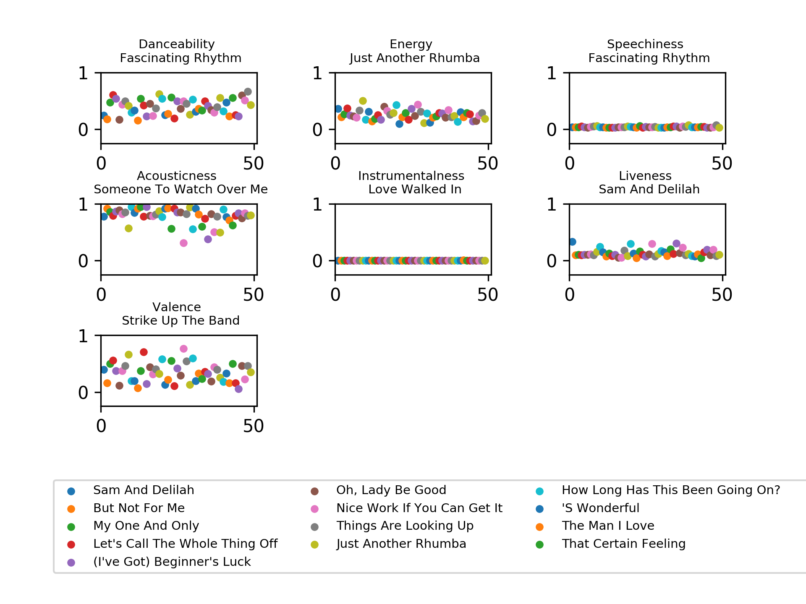

# Spotify-analyzer
 This is a program that analyzes entire albums with [Spotify's stats](https://developer.spotify.com/documentation/web-api/reference/tracks/get-several-audio-features/).
 
This is an example with the [900](https://open.spotify.com/album/3yj1EziuVuch1OayyM95az?si=Z6Uzb4IXTl6ld2-9Ti2ubA) album. It shows the best song in each category in the subplot title and a legend at the bottom.

# Roadmap

• Make it compare in between albums

• Get conclusions in between albums

• Get popularity numbers and cross them with the audio features

    • Get it to next level ideas: 
     
     • Get this into a backend and do it in a web server
 
     • Make it public to use

# More examples

For a large album, [Madam X](https://open.spotify.com/album/1G2YEQPXaOj1JZwa3ZiGe8?si=YA4YSD9MR6SlNerjUM2gcQ):

For the longest album I could find, [Ella Fitzgerald Sings The George And Ira Gershwin Song Book](https://open.spotify.com/album/2vz9bOelnO5EoDBPkzEJjt?si=6xp-6ifPQGusfzhjRA8o7g):

(It runs into [Spotify's API limitation](https://developer.spotify.com/documentation/web-api/reference/albums/get-albums-tracks "Spotify's API - Get an albums' tracks") so it only gets 50 of the 59 songs, but for lols)

# Known Bugs
• Single track albums - I know they don't work at all and throw an error. Not sure how to fix this other than with an exception. WIP (there are not a lot of them so not really worried, but for example [?](https://open.spotify.com/album/1P5VJYlvS4OrUAdzxP82kG?si=Ee2XoEnbQxCPYZzCiJVTvw) with URI 1P5VJYlvS4OrUAdzxP82kG is an album with only one track)
