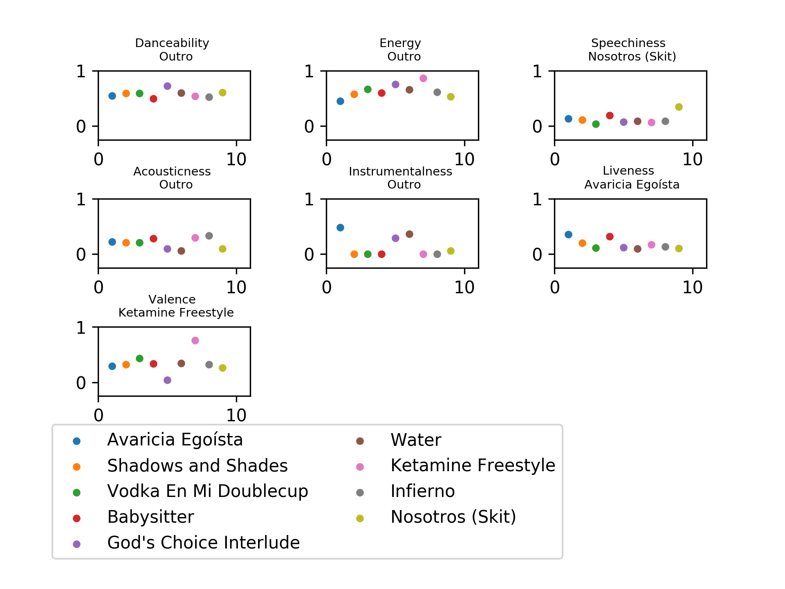

# Spotify-analyzer
 This is a program that analyzes entire albums with Spotify's stats. My idea is that it could plot every song with the different stats and rank them in different ways.
 
This is an example product of the album 900. It shows he best song in each category in the title of the subplot and shows a legend in the bottom.

# Roadmap

• Make it compare in between albums

• Get conclusions in between albums

• Get popularity numbers and cross them with the audio features

    • Get it to next level ideas: 
     
     • Get this into a backend and do it in a web server
 
     • Make it public to use
